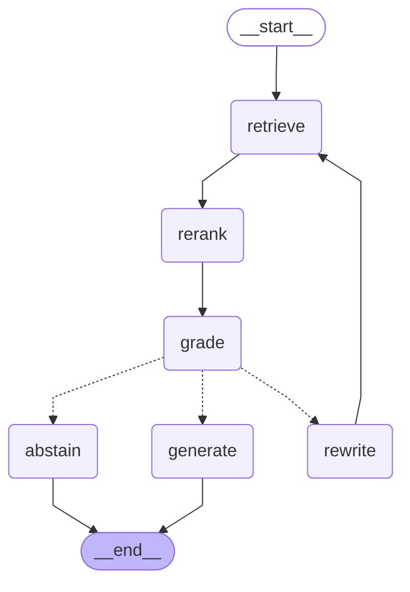

# M4 corrective loop

Generated by `scripts/draw_graph.py` from `halo/graph/pipeline.py`. `grade` routes to `rewrite` while retries remain (max_retries = 2), otherwise to `abstain`.

```mermaid
---
config:
  flowchart:
    curve: linear
---
graph TD;
	__start__([<p>__start__</p>]):::first
	retrieve(retrieve)
	rerank(rerank)
	grade(grade)
	rewrite(rewrite)
	generate(generate)
	abstain(abstain)
	__end__([<p>__end__</p>]):::last
	__start__ --> retrieve;
	grade -.-> abstain;
	grade -.-> generate;
	grade -.-> rewrite;
	rerank --> grade;
	retrieve --> rerank;
	rewrite --> retrieve;
	abstain --> __end__;
	generate --> __end__;
	classDef default fill:#f2f0ff,line-height:1.2
	classDef first fill-opacity:0
	classDef last fill:#bfb6fc
```
